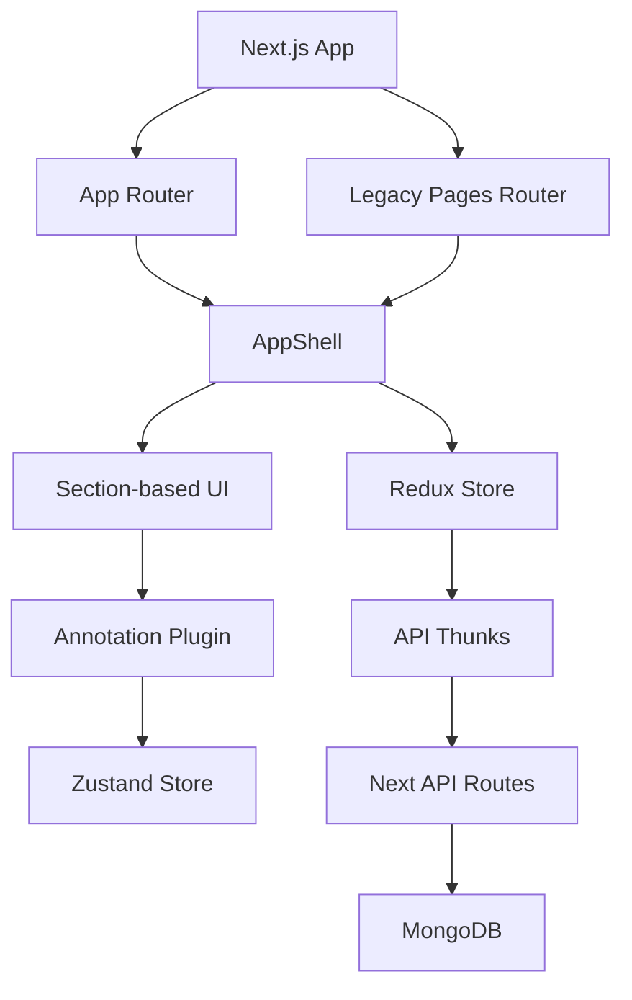

# Acadivate Project Blueprint

This document is the developer entry point for understanding the `acadivate` codebase.

It is intentionally split into focused topic files so a developer can jump directly to the area they need:

- [01. Project Structure](/Users/manishgupta/Desktop/Project/acadivate/docs/blueprint/01-project-structure.md)
- [02. Tech Stack](/Users/manishgupta/Desktop/Project/acadivate/docs/blueprint/02-tech-stack.md)
- [03. Authentication Flow](/Users/manishgupta/Desktop/Project/acadivate/docs/blueprint/03-authentication-flow.md)
- [04. API Routes](/Users/manishgupta/Desktop/Project/acadivate/docs/blueprint/04-api-routes.md)
- [05. Component Hierarchy](/Users/manishgupta/Desktop/Project/acadivate/docs/blueprint/05-component-hierarchy.md)
- [06. Data Flow](/Users/manishgupta/Desktop/Project/acadivate/docs/blueprint/06-data-flow.md)
- [07. Routing Structure](/Users/manishgupta/Desktop/Project/acadivate/docs/blueprint/07-routing-structure.md)
- [08. Business Logic](/Users/manishgupta/Desktop/Project/acadivate/docs/blueprint/08-business-logic.md)
- [09. Database Models](/Users/manishgupta/Desktop/Project/acadivate/docs/blueprint/09-database-models.md)
- [10. Working Flow](/Users/manishgupta/Desktop/Project/acadivate/docs/blueprint/10-working-flow.md)

## Developer Reading Order

For a new developer joining the project, this reading order will make the architecture much easier to understand:

1. Start with [01. Project Structure](/Users/manishgupta/Desktop/Project/acadivate/docs/blueprint/01-project-structure.md)
2. Then read [02. Tech Stack](/Users/manishgupta/Desktop/Project/acadivate/docs/blueprint/02-tech-stack.md)
3. Then go through [07. Routing Structure](/Users/manishgupta/Desktop/Project/acadivate/docs/blueprint/07-routing-structure.md)
4. Then read [06. Data Flow](/Users/manishgupta/Desktop/Project/acadivate/docs/blueprint/06-data-flow.md)
5. After that, study [03. Authentication Flow](/Users/manishgupta/Desktop/Project/acadivate/docs/blueprint/03-authentication-flow.md) and [04. API Routes](/Users/manishgupta/Desktop/Project/acadivate/docs/blueprint/04-api-routes.md)
6. Use [05. Component Hierarchy](/Users/manishgupta/Desktop/Project/acadivate/docs/blueprint/05-component-hierarchy.md) and [08. Business Logic](/Users/manishgupta/Desktop/Project/acadivate/docs/blueprint/08-business-logic.md) while implementing features
7. Keep [09. Database Models](/Users/manishgupta/Desktop/Project/acadivate/docs/blueprint/09-database-models.md) and [10. Working Flow](/Users/manishgupta/Desktop/Project/acadivate/docs/blueprint/10-working-flow.md) open during backend and integration work

## Quick Architecture Summary

## Core Architectural Themes

- The project uses **Next.js with both App Router and Pages Router**
- Global async application state is managed with **Redux Toolkit**
- Annotation interaction state is handled separately with **Zustand**
- Backend data is served through **Next.js route handlers**
- Persistence uses **MongoDB** through the native driver
- The UI is organized around **reusable section components**

## Important Notes For Developers

- Redux is required for most authenticated and content-driven pages
- The annotation plugin has its own local store and DOM-positioning logic
- The app currently mixes public-site pages and dashboard/admin-style pages
- Some routes are app-router wrappers over page components from `src/pages`
- The codebase would benefit from eventual router consolidation and stronger validation

## Suggested Maintenance Workflow

- Update these blueprint files whenever routing, APIs, auth, or data flow changes
- Keep file references accurate
- Prefer adding new architectural notes into the topic file that matches the concern

