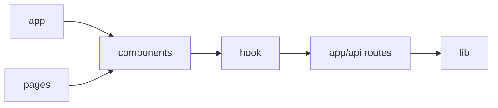

# 01. Project Structure

## Overview

The project is organized around a mixed Next.js routing setup, reusable UI sections, Redux state, and a custom annotation subsystem.

## Structure Tree

```text
acadivate/
├── public/
│   └── assets/Image/*
├── src/
│   ├── app/
│   │   ├── api/{auth,comments,pages}/route.ts
│   │   ├── auth/signin/page.tsx
│   │   ├── dashboard/page.tsx
│   │   ├── admin/page.tsx
│   │   ├── about/page.tsx
│   │   ├── awards/page.tsx
│   │   ├── contact/page.tsx
│   │   ├── registration-form/page.tsx
│   │   ├── nomination-form/page.tsx
│   │   ├── events/
│   │   │   ├── page.tsx
│   │   │   ├── [slug]/page.tsx
│   │   │   ├── international-conferences/page.tsx
│   │   │   ├── upcoming-events/page.tsx
│   │   │   ├── research-forums/page.tsx
│   │   │   └── workshops-fdp/page.tsx
│   │   ├── globals.css
│   │   ├── layout.tsx
│   │   └── page.tsx
│   ├── pages/
│   │   ├── _app.tsx
│   │   ├── Home.tsx
│   │   ├── About.tsx
│   │   ├── Awards.tsx
│   │   ├── Contact.tsx
│   │   ├── EventDetails.tsx
│   │   ├── InternationalConferences.tsx
│   │   ├── ResearchForums.tsx
│   │   ├── UpcomingEvents.tsx
│   │   └── WorkshopsFDP.tsx
│   ├── components/
│   │   ├── layout/
│   │   ├── sections/
│   │   ├── ui/
│   │   ├── auth/login/
│   │   ├── dashboard/
│   │   ├── homePage/
│   │   └── annotationPlugin/
│   ├── hook/
│   │   ├── auth/
│   │   ├── comments/
│   │   ├── pages/
│   │   ├── hooks.ts
│   │   └── store.ts
│   ├── lib/
│   │   ├── mongodb.ts
│   │   └── utils.ts
│   ├── App.tsx
│   ├── main.tsx
│   └── index.css
├── next.config.ts
├── package.json
├── tsconfig.json
└── PROJECT_BLUEPRINT.md
```

## Structural Intent

| Folder | Purpose |
|---|---|
| `src/app` | App Router pages and API route handlers |
| `src/pages` | Legacy pages-router screens |
| `src/components/sections` | Reusable marketing/content sections |
| `src/components/layout` | Shared shell components |
| `src/components/dashboard` | Dashboard-only components |
| `src/components/annotationPlugin` | Annotation/feedback subsystem |
| `src/hook` | Redux slices, thunks, and store |
| `src/lib` | shared utilities and Mongo connection |

## Dependency Notes



## Best Practices Followed

- Clear separation of UI, state, and route handlers
- Dashboard isolated from public-site section components

## Missing / Risks

- Mixed `app` and `pages` routing creates duplication
- Some feature logic is split between multiple folders rather than grouped end-to-end

