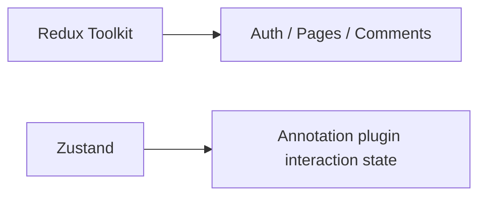

# 02. Tech Stack

## Stack Summary

| Concern | Technology |
|---|---|
| Framework | Next.js 15.2 |
| UI | React 19 |
| Styling | Tailwind CSS v4 |
| Animation | motion/react |
| Global State | Redux Toolkit + React Redux |
| Local Interactive State | Zustand |
| Notifications | sonner |
| Icons | lucide-react |
| Database | MongoDB native driver |
| Language | TypeScript |

## Dependency List

```json
{
  "@reduxjs/toolkit": "^2.11.2",
  "clsx": "^2.1.1",
  "lucide-react": "^0.546.0",
  "mongodb": "^7.1.0",
  "motion": "^12.23.24",
  "next": "^15.2.0",
  "react": "^19.0.0",
  "react-dom": "^19.0.0",
  "react-redux": "^9.2.0",
  "sonner": "^2.0.7",
  "tailwind-merge": "^3.5.0",
  "zustand": "^5.0.8"
}
```

## Styling Stack

- Tailwind is imported from [globals.css](/Users/manishgupta/Desktop/Project/acadivate/src/app/globals.css)
- Theme tokens are declared in `@theme`
- Utility merging is done with `clsx` + `tailwind-merge` in [utils.ts](/Users/manishgupta/Desktop/Project/acadivate/src/lib/utils.ts)

## State Stack



## Best Practices Followed

- Typed store setup
- Theme centralized in global CSS tokens

## Missing / Risks

- No validation library like Zod
- No ORM or typed DB model layer

