# 03. Authentication Flow

## Key Files

- [LoginForm.tsx](/Users/manishgupta/Desktop/Project/acadivate/src/components/auth/login/LoginForm.tsx)
- [authThunks.ts](/Users/manishgupta/Desktop/Project/acadivate/src/hook/auth/authThunks.ts)
- [authSlice.ts](/Users/manishgupta/Desktop/Project/acadivate/src/hook/auth/authSlice.ts)
- [auth route](/Users/manishgupta/Desktop/Project/acadivate/src/app/api/auth/route.ts)
- [Header.tsx](/Users/manishgupta/Desktop/Project/acadivate/src/components/layout/Header.tsx)

## Flow Diagram

```mermaid
flowchart TD
  A["User submits login form"] --> B["dispatch(loginThunk)"]
  B --> C["POST /api/auth"]
  C --> D["MongoDB users collection"]
  D --> C
  C --> E["authSlice fulfilled"]
  E --> F["localStorage persistence"]
  E --> G["Header/useSelector sees auth state"]
  G --> H["Protected UI becomes available"]
```



## Code Path

```ts
const response = await dispatch(loginThunk({ userName, password })).unwrap();
if (response.status === 200) {
  router.push('/');
}
```

## Auth State Shape

```ts
{
  user: User | null,
  token: string | null,
  isAuthenticated: boolean,
  isLoading: boolean,
  error: string | null
}
```

## How It Works

1. User enters username and password in the login form.
2. `loginThunk` sends a `POST` request to `/api/auth`.
3. The API route checks MongoDB `users`.
4. On success, Redux stores the user.
5. `localStorage` is updated on the client.
6. Header and pages re-render using `isAuthenticated`.

## Performance Considerations

- Client-side restore from localStorage is fast
- No extra auth round-trip on every route change

## Missing Best Practices

- Plain-text password check
- No server session/cookie auth
- No role-based route protection middleware

