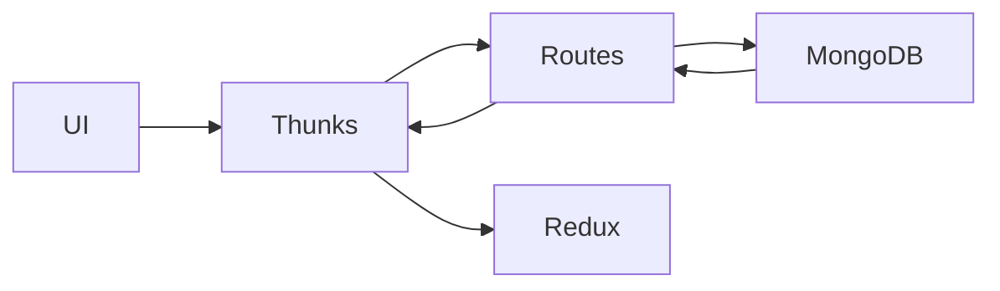

# 04. API Routes

## Route Table

| Route | Method | Purpose | File |
|---|---|---|---|
| `/api/auth` | `POST` | Authenticate user | [route.ts](/Users/manishgupta/Desktop/Project/acadivate/src/app/api/auth/route.ts) |
| `/api/pages` | `GET` | Fetch all pages | [route.ts](/Users/manishgupta/Desktop/Project/acadivate/src/app/api/pages/route.ts) |
| `/api/comments` | `GET` | Fetch all comments | [route.ts](/Users/manishgupta/Desktop/Project/acadivate/src/app/api/comments/route.ts) |
| `/api/comments` | `POST` | Create comment | [route.ts](/Users/manishgupta/Desktop/Project/acadivate/src/app/api/comments/route.ts) |
| `/api/comments?id=` | `PUT` | Update comment | [route.ts](/Users/manishgupta/Desktop/Project/acadivate/src/app/api/comments/route.ts) |
| `/api/comments?id=` | `DELETE` | Delete comment | [route.ts](/Users/manishgupta/Desktop/Project/acadivate/src/app/api/comments/route.ts) |

## Data Flow Diagram

## API Observations

### `/api/auth`

- Validates presence of `userName` and `password`
- Queries `users` collection
- Returns `userName` and `role`

### `/api/pages`

- Currently only supports `GET`
- Reads from `pages` collection
- Frontend thunks expect full CRUD, but backend is partial

### `/api/comments`

- Full CRUD implemented
- Uses `ObjectId` for update/delete

## Performance Considerations

- Simple direct DB access keeps code small
- No caching or pagination

## Missing Best Practices

- No input validation layer
- No auth protection on admin-like data routes
- No service/repository abstraction

