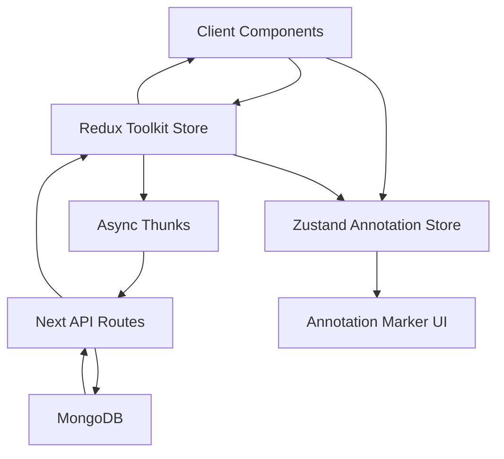

# 06. Data Flow

## High-Level Flow



## Flow Categories

### Authentication

```text
LoginForm -> loginThunk -> /api/auth -> MongoDB -> authSlice -> Header/UI
```

### Pages Content

```text
GetAllHomepage -> fetchPagesThunk -> /api/pages -> pagesSlice -> Home/About/etc.
```

### Comments / Annotation

```text
GetAllCommments -> fetchCommentsThunk -> commentSlice
AnnotatorPlugin -> filter by slug -> setAnnotations in Zustand
Marker -> local interaction + comment thunks
```

## Important Architecture Detail

Comments currently live in two places:

- Redux: canonical async data
- Zustand: interaction/rendering state for plugin

This improves UI responsiveness but introduces sync complexity.

## Best Practices Followed

- Clear separation between async store and interaction store

## Missing / Risks

- Dual-state ownership can introduce bugs if sync is missed

