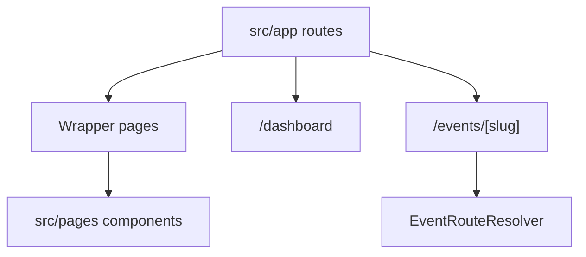

# 07. Routing Structure

## Active App Router Routes

```text
/
/about
/awards
/contact
/dashboard
/admin
/auth/signin
/registration-form
/nomination-form
/events
/events/[slug]
/events/international-conferences
/events/upcoming-events
/events/research-forums
/events/workshops-fdp
```

## Legacy Pages Router Routes

```text
/Home
/About
/Awards
/Contact
/EventDetails
/InternationalConferences
/ResearchForums
/UpcomingEvents
/WorkshopsFDP
```

## Routing Diagram



## Dynamic Routing

- [src/app/events/[slug]/page.tsx](/Users/manishgupta/Desktop/Project/acadivate/src/app/events/[slug]/page.tsx)
- Slug is passed into [EventRouteResolver.tsx](/Users/manishgupta/Desktop/Project/acadivate/src/components/sections/EventRouteResolver.tsx)

## Middleware

No middleware file exists.

## Architectural Note

The project is in a transition state:

- App Router is the public entry surface
- Pages Router still contains most page implementations

## Recommendation

Gradually migrate `src/pages/*.tsx` into app-router-native route components.

