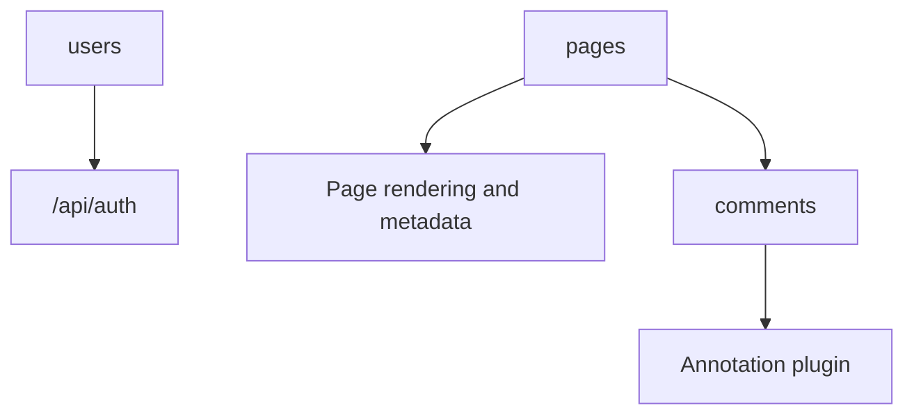

# 09. Database Models

## Database Technology

- MongoDB native driver
- Connection managed in [mongodb.ts](/Users/manishgupta/Desktop/Project/acadivate/src/lib/mongodb.ts)

## Collections

```text
users
pages
comments
```

## Inferred User Model

```ts
type User = {
  userName: string;
  password: string;
  role?: string;
};
```

## Inferred Page Model

```ts
type Page = {
  _id?: string;
  title?: string;
  slug?: string;
  content?: string;
  status?: string;
  type?: string;
  template?: string;
  sections?: any[];
  seo?: {
    metaTitle?: string;
    metaDescription?: string;
  };
  createdAt?: string;
  updatedAt?: string;
  isHomepage?: boolean;
};
```

## Inferred Comment Model

```ts
type Annotation = {
  _id?: string;
  id: string;
  pageId?: string;
  slug?: string;
  selector?: string;
  offsetX?: number;
  offsetY?: number;
  content?: string;
  status?: 'open' | 'pending' | 'done';
  screenSize?: 'mobile' | 'tablet' | 'desktop' | 'all';
  createdAt?: number;
};
```

## Model Relationship Diagram



## Missing

- No formal schema enforcement
- No ORM or migration tooling

