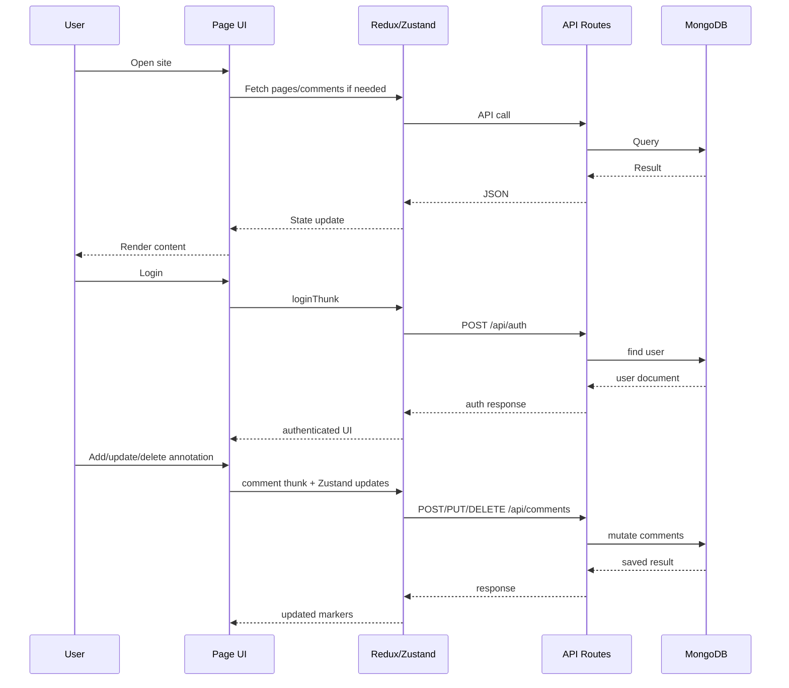

# 10. Working Flow

## End-to-End User Journey



## Developer Mental Model

### Public Content Flow

```text
Route -> wrapper page -> src/pages component -> section components -> Redux-backed data
```

### Admin/Dashboard Flow

```text
/dashboard -> DashboardPage -> dashboard components
```

### Annotation Flow

```text
Authenticated user -> open annotator -> click target -> save comment
-> comment thunk -> DB
-> Redux comments
-> Zustand annotations
-> Marker render
```

## Request/Response Cycle

```text
Browser event
  -> component handler
  -> thunk/store action
  -> API route
  -> MongoDB
  -> API JSON response
  -> store update
  -> rerender
```

## Common Developer Workflows

### Adding a new marketing section

1. Create section under `src/components/sections`
2. Compose it into a page in `src/pages`
3. Expose through app-router wrapper in `src/app`

### Adding a new API-backed feature

1. Add route handler in `src/app/api`
2. Add thunk in `src/hook/<feature>`
3. Add slice state handling
4. Connect client component

### Updating annotation behavior

1. Update plugin UI in `AnnotatorPlugin.tsx` or `Marker.tsx`
2. Update DOM utilities in `utils.ts`
3. Update Zustand state if needed
4. Update Redux thunks if persistence changes

## Risks to Watch

- mixed router behavior
- duplicated providers/wrappers
- state drift between Redux and Zustand
- unvalidated API payloads

